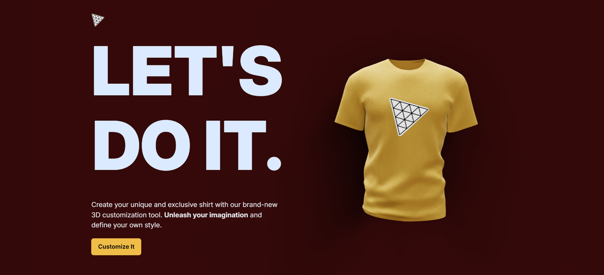
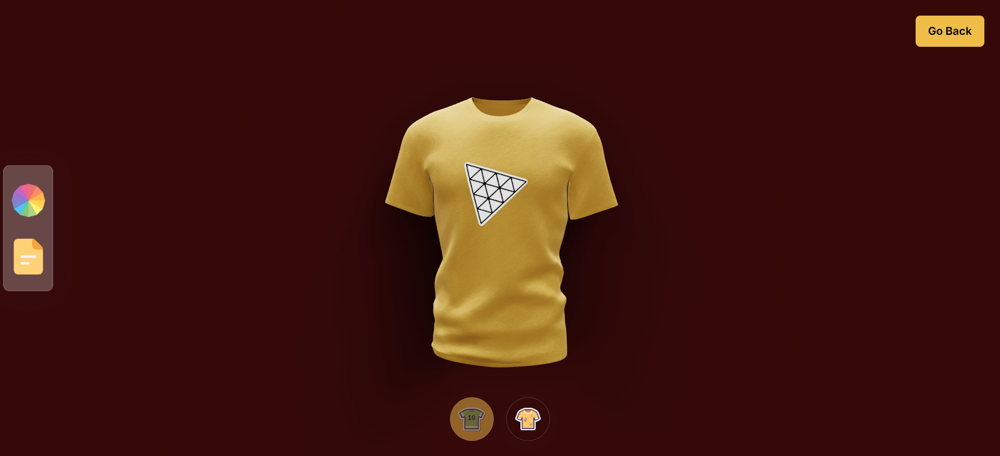

# Image.AI

#### Preview: https://imageai-3d.netlify.app/

# Packages Installed

##### npm create vite@latest -- --template react client || npm i three @react-three/fiber || npm i @react-three/drei || npm i maath || npm i valtio || npm i react-color || nmp i framer-motion ||

##### Adding Tailwind CSS => npm install -D tailwindcss postcss autoprefixer || npx tailwindcss init -p || Update the tailwind.config.js || Add the CSS directives to Index.css.

# Initial Work

##### Added custom Public, Assets, Index.css, & Config folder. Created pages, components, & canvas folder. |||| Public has icons and glbs file(3). Assets has images and index.js to import the images(7). Canvas has Index.jsx(1). Config has the config.js file, constants.js for data, helpers.js for some math, motion.js for some animation. And Index.css has some pre-written css for the web app.

###### Imtious Islam
